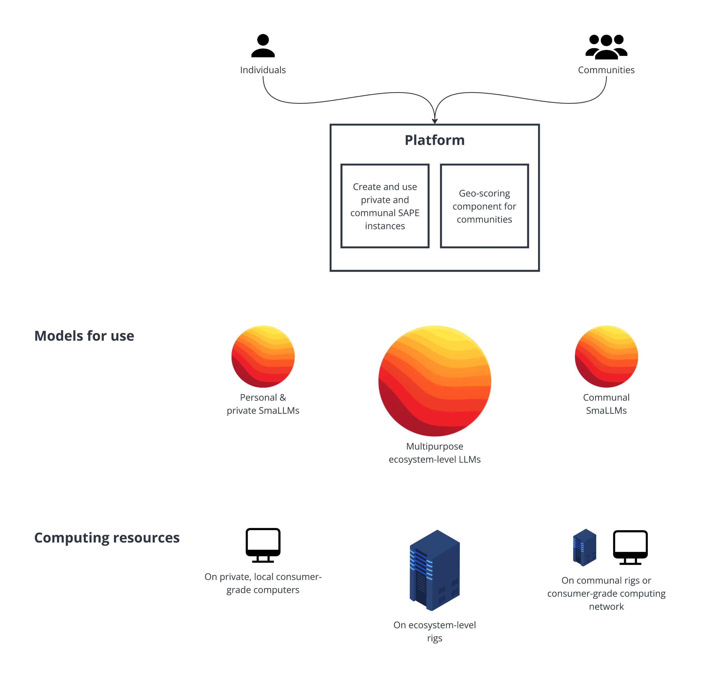
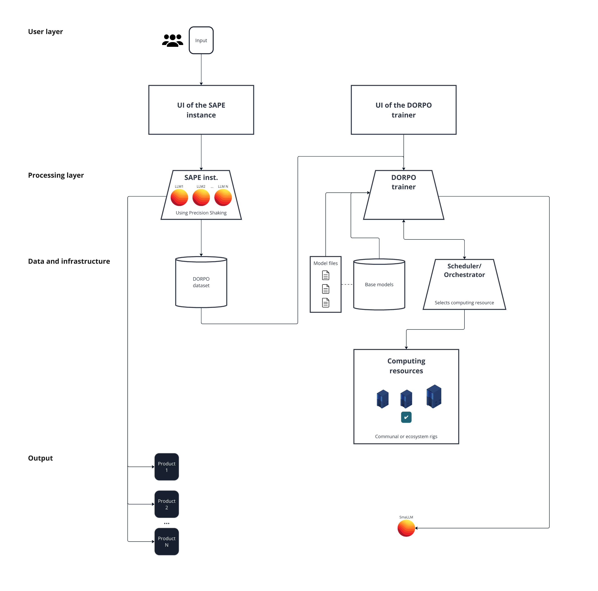
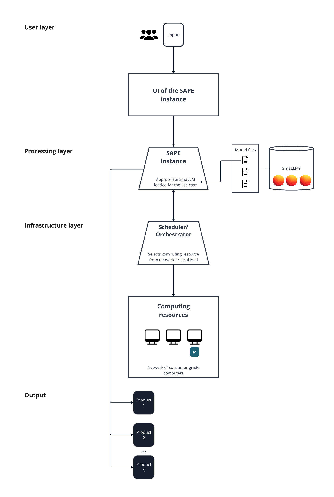

# OpZest Ecosystem - Blueprint

**Author**: Áron Cserveni

**Date**: July 1, 2024

---

## Introduction

Humanity is facing significant challenges as new technologies continue to reshape our world. Artificial Intelligence (AI) is a game-changer, with the potential to revolutionize industries, automate jobs, and improve our daily lives in ways we can only begin to imagine. Moreover, this transformation comes with its own set of problems that demand our attention.

In my previous work, I noted, "There is a risk that many individuals and organizations may be left behind because they do not have the resources, knowledge, or established positions needed to compete. Some fear losing their jobs or business, further limiting their ability to participate in the technological revolution. This could lead to feelings of disempowerment, anxiety, and instability. Additionally, the growing dominance of a few powerful AI companies could lead to monopolistic situations where they control the means of production and innovation, potentially hindering growth for smaller organizations.

To address these challenges, we need a paradigm shift toward a more inclusive AI landscape where smaller companies, individuals, and diverse organizations have a more level playing field to contribute and effect change" [1]. In this document, I propose a solution through the introduction of Operation Zest (OpZest) - an ecosystem dedicated to promoting people, communities, and businesses toward a more equitable and sustainable future in our AI-propelled world. OpZest is built upon a platform that utilizes concepts such as Precision Shaking (PS), DORPO and SAPE [1]. The platform enables participants to create, train, and use smaller language models (SmaLLMs), which can be run on store-bought laptops or computers, without requiring high-performance hardware. OpZest is designed with a community-driven approach and intends to foster a sense of belonging and shared goals among participants

The focus of this paper is on Large Language Model (LLM) applications, but the concept can be expanded to encompass various types of AI models.

> **_Note:_** I continuously update this document as our team progresses with building the ecosystem.

## Ecosystem

OpZest is an ecosystem that combines production and utilization of AI models and software and cyber-physical systems, and infrastructure provisioning. Local communities form the foundation of the ecosystem and center around a shared concept or mission. At the heart of the system is a platform that enables communities and individuals to create, train, and utilize SmaLLMs - smaller language models that can be run efficiently, even on consumer-grade computers. The platform also includes a geo-scoring component to visualize community progress on a map based on their contributions and usage.

**Computing Resources**

The ecosystem consists of several tiers of computing resources:

1. **Private, Local Computers:** Isolated, private consumer-grade computers not connected to any network within the ecosystem.
2. **Consumer-Grade Network:** A network of consumer-grade computers dedicated to running SmaLLMs primarily for communal purposes.
3. **Communal Rigs:** Advanced computing rigs with more powerful GPUs operated by communities for running and training SmaLLMs.
4. **Ecosystem-Level Rigs:** Advanced, globally operated computing rigs primarily utilized for training models and running multipurpose LLMs.

**Model Types**

The ecosystem features three types of models:

1. **Personal and Private SmaLLMs**: Each individual can train and use their own private and personal SmaLLM (or agent) for specific tasks or as an assistant. These models can be deployed on private, local computers at home.
2. **Communal SmaLLMs:** SmaLLMs (or agents) for communities (and individuals) to create digital products, complete tasks, and serve internal purposes, running on communal rigs or the network of consumer-grade computers. These models are the key drivers of value creation.
3. **Multi-purpose Ecosystem-Level LLMs:** Globally accessible LLMs (or agents) with broader knowledge and skills trained by the ecosystem community, designed to assist in tasks where suitable SmaLLMs are not available or for general-purpose applications. These run on ecosystem-level rigs.

> **_Note:_** Future updates of this paper will cover the design of networks. Additionally, our team plans to explore the integration of blockchain technology to enhance data security and authenticity during model training, and potentially to secure and verify the outputs of the language models.

SmaLLMs are not only domain-specific but tailored to specific use cases. This approach facilitates efficiency and optimal outputs.

## Primary Modules

The following sections offer a high-level overview of the primary modules, which include the creation/training and utilization of SmaLLMs. It's important to note that they do not address components such as the API gateway, message queue, authentication/authorization, monitoring and logging, network infrastructure, and other auxiliary services. These aspects will be covered in future updates of the paper.

### Creation of SmaLLMs (Training)

Local community members or individuals interact with the user interface of a Semi-Autonomous Production Engine (SAPE) instance, which is a model-agnostic system that operates in iterative cycles and orchestrates LLM inferences guided by textual user feedback, creating or modifying digital products or solutions. The SAPE instance integrates Precision Shaking, a guided knowledge elicitation method designed to extract knowledge and skills from multiple AI models for subsequent application in training. 

The elicited knowledge is stored in the DOPRO database. When sufficient data exists in the database, the system selects the base language model most suitable for the given use case. These models can be one of two types: pre-trained language models that are openly accessible or models created from scratch by the ecosystem team and pre-trained on a dataset that fits the given scenario. In both cases, it's important to experiment with the number of model parameters to ensure reasonable performance on consumer-grade computers.

The training process begins using the DORPO method. The scheduler/orchestrator component governs which computing resource is summoned from the network, be it a communal rig or an ecosystem rig, and assumes responsibility for task allocation. When resources are insufficient, the scheduler initiates a queue to assess and manage pending training jobs equitably.

DORPO extends the concept of ORPO [2] by integrating distillation with preference optimization. DORPO ensures that the SmaLLM not only inherits the LLMs’ expertise but also optimizes its outputs, potentially resulting in a model that is both knowledgeable and aligned while being able to produce output more efficiently.

> **_Note:_** For further details on PS and DORPO, please refer to the Precision Shaking and DORPO white paper [1].

Notably, this module has dual-output capabilities, generating both a SmaLLM and products/value during the training process.

### Utilization of SmaLLMs

Instead of LLMs, the Utilization module leverages SmaLLMs that have previously been trained for the given use case using the PS-DORPO methods. In contrast to the Training module, this module does not (necessarily) involve model training. The SAPE instance identifies and loads the suitable SmaLLM based on the intended application within the given SAPE cycle or session.

The type of SAPE session determines which SmaLLMs can be accessed: either personal and private or communal. During utilization, the scheduler assigns computing resources from the network of consumer-grade computers or, in cases where instructed for private or personal scenarios, loads the SmaLLM onto the user’s local computer. Although the system's goal is to minimize the need for quantization, there may be situations where a degree of quantization is necessary to allow the model to run properly on the specific consumer-grade computer that is being used.

The primary goal of this module is to create products (demonstrate value), complete tasks or solve problems. Additionally, further training the SmaLLMs during utilization may be explored as described in the second point of the Recommendations section of the Precision Shaking and DORPO white paper [1].

> **_Note:_** If a session involves tasks that a single use-case-specific SmaLLM cannot handle alone, implementing an orchestration of multiple models in a chain-like configuration is required.

## Utilization Framework

The framework outlines internal and external applications of SmaLLMs.

### Internal Applications
- **Private**: For personal purposes or creating assistants for daily tasks
- **Communal**: For tasks required for the operation of the community itself
- **Improving the Ecosystem**: Creating new and maintaining existing software components of the ecosystem

### External Applications (for Communities and Individuals)
- **Innovation**: Creating and realizing new product concepts
- **Monetization**: Generating revenue by creating value for people or organizations outside of the ecosystem

### Use cases

Without claiming to be exhaustive, here is a list of a few potential use cases:
* Developing/modifying software, even complex codebases
* Creating games, modifying game levels, characters, or narratives
* Interactive educational experiences; creating on-the-fly, personalized instruction material
* Architecture
* Equipment automation, integration with IoT devices
* Crafting code-based videos
* Creating/running simulations
* Developing a new language

## Incentive

The ecosystem functions to create products, and therefore value, while empowering participants to develop and run their own language models. This approach is intended to reduce dependence, and may allow users to feel important and valued even in a heavily AI-propelled environment; it blends the strengths of both human involvement and advanced technology.

The system is built around community-driven missions, concepts, and use cases. People who trust and know each other are essential for creating a sense of belonging and shared goals. To incentivize people to build local communities, a geo-scoring component is introduced to the platform. This feature displays the progress and contributions of a given community on a map.

To facilitate the creation of local communities, our ecosystem operates on an invitation-based framework. Members of existing communities can invite others within a certain geographic range to join their group. The rules governing this range are to be determined.

Although the invitation-based framework may imply exclusivity, the system is open to everyone. If there is no community in a particular location, the ecosystem welcomes the first person interested in joining to establish a community, effectively becoming the founder.

## Conclusion

In summary, the ecosystem's goal is to set a shift in motion toward a more inclusive AI space where smaller companies, individuals, and diverse organizations can contribute and drive change. By leveraging Precision Shaking, DORPO, and SAPE concepts [1], the ecosystem enables both technical and non-technical individuals to participate in the creation of value through consumer-grade computing resources, forming communities, and collaboratively producing products. The ecosystem is designed around semi-autonomy, where human steering and AI technologies work together. Individuals and communities can create and use personally and communally aligned SmaLLMs that are efficient and facilitate optimal output.

Alongside the detailed benefits, there are limitations to consider. Further engineering is needed to effectively design the connection between computing resources and orchestration handling for an efficient network. Running SmaLLMs on consumer-grade computers may result in a noticeably slower inference time compared to hosted, closed-source LLMs. However, adapting to this decreased speed can be considered an acceptable tradeoff for reducing dependency on external providers. Additionally, PS and DORPO are conceptual foundations at this point only, therefore further work is necessary to refine these methods [1].

## References

1. Cserveni, Á. (2024). Precision Shaking and DORPO: Conceptual Foundations of LLM Knowledge Distillation Methods. GitHub repository. [https://github.com/OpZest/Papers/blob/main/White_papers/Precision_Shaking_and_DORPO.md](https://github.com/OpZest/Papers/blob/main/White_papers/Precision_Shaking_and_DORPO.md)

2. Hong, J., Lee, N., & Thorne, J. (2024). ORPO: Monolithic Preference Optimization without Reference Model. arXiv:2403.07691. [https://arxiv.org/pdf/2403.07691](https://arxiv.org/pdf/2403.07691)
