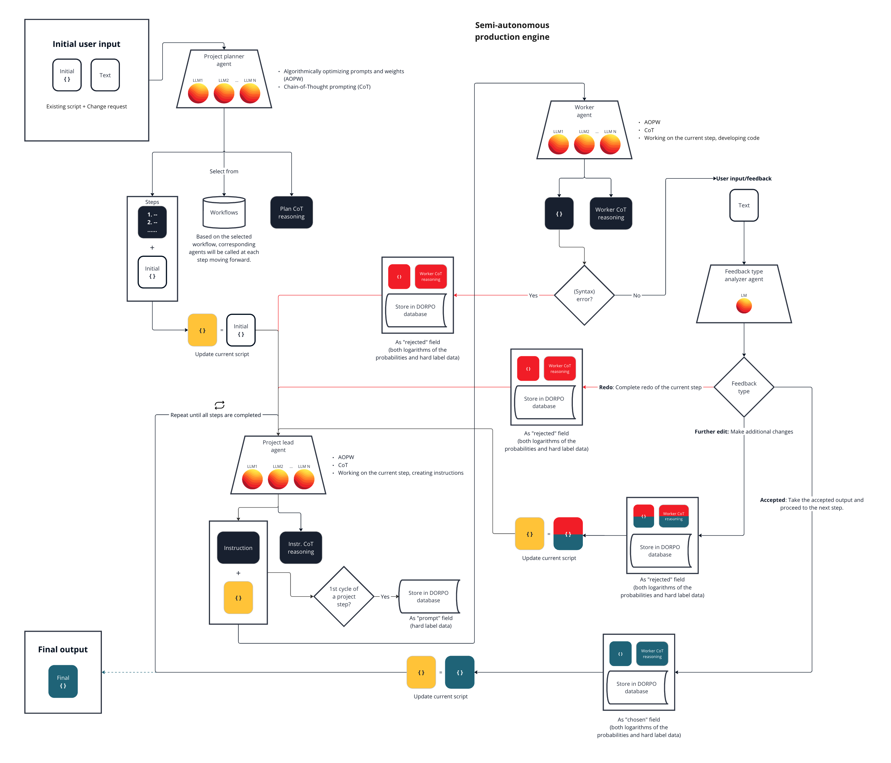

# Precision Shaking and DORPO: Conceptual Foundations of LLM Knowledge Distillation Methods

**Author**: Áron Cserveni

**Date**: June 21, 2024

---

## Abstract
The concepts of Precision Shaking (PS) and Distillation-Oriented Odds Ratio Preference Optimization (DORPO) aim to create more efficient and accessible versions of Large Language Models (LLMs) for various use cases. PS is a guided knowledge elicitation method that extracts skills from multiple teacher models using a semi-autonomous production engine (SAPE). SAPE orchestrates LLM inferences guided by textual user feedback, creating or modifying digital products or solutions while generating a targeted dataset for the subsequent DORPO training. DORPO is an extension of Odds Ratio Preference Optimization (ORPO), which integrates distillation with preference optimization to align the student model with preferences while inheriting expertise from the teacher model. This theoretical paper highlights the potential of these concepts in creating more efficient, smaller language models, SmaLLMs, without empirical data or test results, aiming to provide a foundation for future research.

## Introduction

Artificial Intelligence (AI) technologies have significant impact on our world, posing both opportunities and challenges for various industries and daily life. While these technologies offer potential benefits, they also raise concerns about economic disparities and concentration of power among select entities.

Many individuals and organizations may struggle to keep up or adapt because they do not have the resources, knowledge, or established positions needed to compete. Some fear facing significant disruption, which could further limit their ability to participate in the technological revolution. Additionally, the growing dominance of a few powerful AI companies could spark concerns about potential scenarios where they control the means of production and innovation, as well as questions regarding how these systems handle private and sensitive user data.

To address these challenges, we need a paradigm shift toward a more inclusive AI landscape where smaller companies, individuals, and diverse organizations have a more level playing field to contribute and effect change. Precision Shaking (PS) and Distillation-Oriented Odds Ratio Preference Optimization (DORPO) are concepts designed to train and run effective and efficient bespoke AI models privately, helping to achieve a more balanced AI ecosystem and reduce the users' dependence on dominant tech companies.

The focus of this paper is on demonstrating how these concepts can be employed to create more efficient and accessible versions of Large Language Models (LLMs). However, it is crucial to recognize that the concepts explored herein extend beyond just LLMs and may be applicable to other type of models or domains, albeit with potential adjustments necessary for successful implementation. The goal of this work is to construct a theoretical framework without including test results or empirical data, aiming to create a foundation for future research.

## Concepts
### SmaLLM
SmaLLM is a smaller language model, not introduced as a new concept, but rather as a naming convention. SmaLLMs are trained on datasets elicited from teacher LLMs.
### Precision Shaking
Precision Shaking (PS) is a guided knowledge elicitation method designed to extract knowledge and skills from multiple AI models for subsequent application in creating SmaLLMs. Inspired by shaking a tree to catch fruit, PS identifies the right "branches" of the AI model to elicit the desired knowledge or skills. Prioritizing depth and quality, the idea behind PS is to produce datasets that can be used to train SmaLLMs outperforming their teacher models in terms of efficiency.

The PS mechanism involves a model-agnostic Semi-Autonomous Production Engine (SAPE), which operates in iterative cycles and orchestrates LLM inferences guided by textual user feedback, creating or modifying digital products or solutions while generating a targeted dataset, including preference optimization data, making it suitable for use in DORPO training (as detailed below). Every SAPE instance includes predefined AI agents and a workflow tailored to a specific use case. These agents have access to a pool of LLMs, with the workflow determining which agents can interact with one another, establishing the sequence (chain) of agents, governing the information flow, and defining communication channels between them. 

The SAPE instance manages communication, data transfer, and orchestration among its agents. Each agent employs algorithmically optimized prompts and weights using DSPy [1], and applies Chain-of-Thought (CoT) prompting [2]. SAPE agents interact with LLMs to extract knowledge from them, while user feedback shapes the outcome of every cycle. When PS is applied, it centers around a specific use case, and has a dual-output capacity, producing both the dataset and a product or solution as a byproduct.

### DORPO
Distillation-Oriented Odds Ratio Preference Optimization (DORPO) is a modified version of Odds Ratio Preference Optimization (ORPO). The ORPO method is a preference alignment algorithm that integrates odds-ratio-based penalties into the negative log-likelihood loss function, effectively differentiating favored (“chosen”) and disfavored (“rejected”) responses without the need for a reference model or an additional preference alignment phase [3]. Empirical results demonstrate that ORPO outperforms state-of-the-art models in various benchmarks [3].

DORPO extends the concept of ORPO by integrating distillation with preference optimization. In DORPO, a student model learns from a larger, pre-trained teacher model while also aligning with preferences. The method involves two key components: Kullback–Leibler Divergence (KLD) [4] loss and Odds Ratio loss. The KLD loss is calculated using the soft targets derived from the teacher model's output log probabilities, ensuring the student model captures the nuanced knowledge of the teacher. Simultaneously, the Odds Ratio loss compares the probabilities of "chosen" and "rejected" outputs using hard labels, as in ORPO, to align the student model with preferences. By combining these losses, DORPO ensures that the student model not only inherits the teacher model's expertise but also optimizes its outputs, potentially resulting in a model that is both knowledgeable and aligned.

## Mechanism
#### Precision Shaking
To elucidate the mechanism of PS by using a SAPE instance, let us presume a hypothetical scenario where the SAPE instance is designed for enhancing or further developing an existing executable software script. In this context, our objective is to extract knowledge from teacher models, which will be subsequently utilized to train an instruction-following SmaLLM. In fact, the applicability of PS extends beyond this use case to include any programmable application, even complex codebases, problem-solving, tool creation, planning projects, and multi-modal setups, among other potential uses.

> **_Note:_** This section does not cover every aspect of the SAPE instance's functioning as some are not essential for understanding how PS operates. 

Figure 1 depicts the PS-SAPE mechanism. The initial user input to the system is a script to be changed or developed and a change request as instruction. The input data is processed through the SAPE instance. The SAPE workflow for our hypothetical scenario involves:

1. A project planner agent that creates discrete project steps for the system to execute.
2. A project lead agent responsible for interpreting, processing, and understanding each step, along with feedback from the system or user, generating instructions that are subsequently passed to the worker agent.
3. A specalized worker agent tasked with creating outputs based on the instructions it receives.
4. A feedback type analyzer agent categorizes user feedback, enabling the SAPE instance to respond appropriately based on the feedback type received.

*Figure 1: Precision Shaking using a SAPE instance*

The workflow begins with the project planner agent generating the project steps. The system maintains a "current script" variable, which is first updated with the user's initial input script. Upon receiving the current project step and script from the project planner agent, the project lead agent initiates a cycle. It analyzes the step and generates an instruction based on that analysis and the current script. This instruction, along with the current script, is then passed to the worker agent for implementation, and stored as hard label data within the DORPO database under the "prompt" field (in case it is generated during the first cycle of a given project step).

The worker agent modifies the script according to the received instructions and outputs a modified script along with CoT reasoning. The system executes the output script, and in case of a logged error, stores the erroneous script and CoT reasoning in the DORPO database under the "rejected" field (hard label data), paired with the corresponding data point from the "prompt" field containing the first cycle's instruction data. The error and erroneous script are returned to the project lead agent, which analyzes the problem and creates a new instruction for the worker agent to correct.

Assuming the worker agent's correction is no longer erroneous, the subsequent comoponent is user feedback. The user is presented with an executable version of the modified script for evaluation. The textual feedback the user provides undergoes analysis by the feedback analyzer agent's Language Model (LM), resulting in one of three possible outcomes: Redo, Further edit, or Accepted. Redo refers to the process where the output generated by a worker agent in a given cycle is found to be incorrect or deviating from expectations, necessitating a complete re-execution; Further edit signifies that certain components of the worker agent's output are acceptable, but additional refinements are required to align with the anticipated outcome of the current project step; Accepted means that the generated result conforms to the expectations, and the system can begin processing the subsequent project step.

In the event of a Redo outcome, similar to the error scenario discussed earlier, a new entry is generated and the incorrectly modified script and CoT reasoning are saved in the DORPO database under the "rejected" field (hard label data), alongside the corresponding "prompt" data point containing instruction data from the first cycle. The system initiates a new cycle, and the project lead agent analyzes the faulty script, coupled with the current script resulting in a revised instruction for the worker agent aimed at rectifying the issue and yielding a result compatible with the present project step's requirements. Following this, the user is prompted to provide feedback.

In case of the user feedback encounters a Further edit scenario, another new entry is created and the modified script and CoT reasoning are stored in the DORPO database under the "rejected" field (hard label data), together with the corresponding "prompt" data point containing instruction data from the first cycle. Subsequently, the current script is updated to reflect the modified version for the project lead agent's consideration. The project lead agent then creates a further-edit-type correction instruction for the worker agent that modifies the script accordingly. Afterward, the user is invited to offer feedback.

Should the user approve the script, as it adheres to the requirements of the given project step, a new entry is inserted and the accepted script and CoT reasoning are saved in DORPO database under the "chosen" field (both the logarithms of the probabilities and hard label data) for every row bearing instruction data from the first cycle of the given project step. In situations where no previous Error, Redo, or Further edit cycles exist within the current project step, the system adds the accepted script and CoT reasoning next to the one and only  "prompt" data point reflecting the current project step, and leaves the "rejected" field empty. The current script becomes the accepted version, and the process continues, evolving in accordance with user feedback until all steps are finalized, culminating in the desired output – the anticipated result of the SAPE session.

> **_Note:_**  In order to optimize the shaking process, the system may implement a selective multi-teacher knowledge/skill elicitation strategy. Specifically, if the worker agent fails to produce an acceptable output after a predetermined number of attempts, at a given step, the system will direct the agent to utilize one of the other LLMs assigned to it for generating the desired output.

#### DORPO

Sufficient data availability in the DORPO database is a prerequisite for initiating the training process.

Figure 2 and the following paragraphs illustrate the implementation of the DORPO method.

*Figure 2: DORPO training*

The DORPO method implements a smaller, pre-trained student LM as a base model. The DORPO dataset consists of three fields: "prompt" (hard label), "chosen" (log probabilities and hard label),  and "rejected" (hard label). These fields have been populated during numerous Precision Shaking sessions. The "chosen" field contains the preferred examples, while the "rejected" field includes the disfavored ones for the Odds Ratio loss calculation. From this point on, when we refer to the teacher model's output, we refer to these fields.

The key components are the KLD loss for "chosen" data, and the Odds Ratio loss.

**KLD loss for "chosen" data:**

The KLD loss aligns the student model's probability distribution for the "chosen" response with the teacher model's distribution. The KLD between the teacher's and student's distributions for the "chosen" response is minimized. 

Its purpose is to help the student model capture the nuanced output characteristics of the teacher model for "chosen" responses.

Data used: 
- Data from "prompt" field to prompt the student model to generate predicted probabilities (x)
- Soft labels representing the "chosen" data (log probabilities for y+)

**Odds Ratio loss:**

The Odds Ratio loss balances the preference for the "chosen" data over "rejected" data [3]. It uses the Odds Ratio between them to adjust the model's preference.

Odds calculation:

- **"Chosen" response odds**:

- **"Rejected" response odds**:

The goal is to ensure that the student model strongly prefers the "chosen" response over the "rejected" one by balancing their probabilities.

Data used:
- Hard label data for both "chosen" (y+) and "rejected" (y-) responses

**DORPO loss:**

The total loss function used to train the student model in DORPO is a weighted combination of the above components.

- $\lambda$: A weight to balance the importance of the Odds Ratio loss and KLD loss.

After completing the forward pass and calculating the losses, the next step is to perform the backward pass and update the model parameters. This process is then repeated for each data batch until convergence.

> **_Note_**: If "rejected" data is not present in a given training dataset row, the Odds Ratio loss calculation will be disregarded and the loss calculation will default to solely KLD loss. Furthermore, when log probabilities are unavailable, the training process reverts back to utilizing only hard label data (as obtained through PS). In such instances, revisiting the loss function is necessary.

## Conclusion
PS and DORPO are concepts designed to empower users, often regardless of their background or expertise, to train and run effective and efficient bespoke models for specific use cases. Yet, it is essential to acknowledge that key limitation of this work is the absence of empirical data or test results. Additionally, this paper focuses solely on LLM application and does not explore how the concepts can be applied to other types of models. Moreover, it presents a SAPE instance with a one-file setup designed with a coding objective in mind for demonstration purposes of PS, which does not reflect many other potential real-world scenarios that involve other objectives, more complex workflows, orchestration, or hierarchies.

## Recommendations
Several avenues for future research are recommended to validate the applicability and effectiveness of the proposed concepts:

1. Future research should focus on empirically testing the concepts introduced above to validate their applicability and effectiveness.
2. After the DORPO training step introduced in this paper, additional stages should be considered to enhance the performance of the SmaLLM.
* The first step is to implement a side-chain where the SmaLLM is integrated. In this setup, whenever an agent calls LLMs with a given prompt, the same prompt is also fed into a SmaLLM. The LLMs give feedback on the SmaLLM’s output which is used to create a new dataset. These preferences are distilled into the SmaLLM to improve its performance.
* After the above, the SmaLLMs should replace LLMs within an agent's structure, while retaining side-chain LLMs for backup. In case a SmaLLM fails to produce "Accepted" outputs after a specific number of attempts, the side-chain LLMs are called. When the side-chain LLMs are called, a new dataset is created using their outputs (hard labels and log probs), which can be used to further fine-tune the SmaLLM and improve its effectiveness.
3. There could be various datasets created and harvested at different logical points within the SAPE flow for more detailed analysis. 
4. Further research is required to determine the optimal lambda value of the OR loss for different use cases.
5. It is suggested to explore the use of soft labels for the OR loss component to leverage the detailed probabilistic outputs of the teacher model, potentially enhancing the nuanced learning and generalization capabilities of the student model.
6. Experiments should be conducted where base models are created from scratch for specific use cases, pre-trained on corpora that fit the given scenario, and then trained using PS and DORPO.

## References

1. Khattab, O., Singhvi, A., Maheshwari, P., Zhang, Z., Santhanam, K., Vardhamanan, S., Haq, S., Sharma, A., Joshi, T. T., Moazam, H., Miller, H., Zaharia, M., & Potts, C. (2023). *DSPY: Compiling Declarative Language Model Calls into Self-Improving Pipelines*. arXiv:2310.03714. [https://arxiv.org/pdf/2310.03714](https://arxiv.org/pdf/2310.03714)

2. Wei, J., Wang, X., Schuurmans, D., Bosma, M., Ichter, B., Xia, F., Chi, E. H., Le, Q. V., & Zhou, D. (2023). *Chain-of-Thought Prompting Elicits Reasoning in Large Language Models*. arXiv:2201.11903. [https://arxiv.org/pdf/2201.11903](https://arxiv.org/pdf/2201.11903)

3. Hong, J., Lee, N., & Thorne, J. (2024). *ORPO: Monolithic Preference Optimization without Reference Model*. arXiv:2403.07691. [https://arxiv.org/pdf/2403.07691](https://arxiv.org/pdf/2403.07691)

4. Kullback, S., & Leibler, R. A. (1951). *On Information and Sufficiency*. The Annals of Mathematical Statistics, 22(1), 79-86. [https://www.jstor.org/stable/2236703](https://www.jstor.org/stable/2236703)
